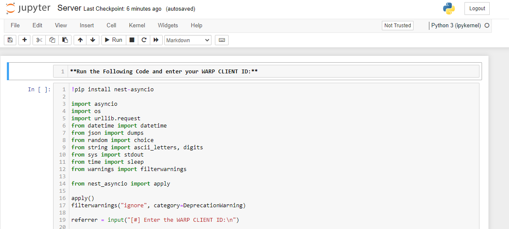

<div align="center">
<a name="warp-unlimited-new-methods"></a>

# ♻️ WARP UNLIMITED ADVANCED
**Get unlimited amount of data in Cloudflare's WARP, most versatile code written in our beloved Python! ethically of course.**
</div>

## **📑 INDEX**
#### **Easily navigate through out the guide and pick the best method that suits you and your requirements!**
+ [**♻️ WARP UNLIMITED ADVANCED**](#warp-unlimited-new-methods)
+ [**📑 Features**](#features)
+ [**🪧 Before you Proceed**](#before-you-proceed)
+ [**⚙️ How to use ? 😅 How to get WARP CLIENT ID ?**](#how-to-use)
+ [**→ 🕹️ Run on Google Colab**](#run-on-google-colab)
+ <b><a href="#deploy-to-koyeb">→   Deploy on Koyeb (24x7)</a></b>
+ [**→ ⚡ Host on Heroku (24×7)**](#host-on-heroku)
+ [**→ 🧿 Host on Railway (24×7)**](#host-on-railway)
+ [**→ 🪬 Host on Okteto (24×7)**](#host-on-okteto)
+ [**→ 🖥️ Run on Computer/VPS**](#run-on-computer)
+ [**→ 🧫 Deploy through GitHub Actions**](#deploy-using-github-actions)
+ [**→ 📲 Run on Mobile Phone**](#run-on-mobile-phone)
+ [**→ 🎲 Run on Replit**](#run-on-replit)
+ [**→ 🧰 Run on Jupyter Server**](#run-on-jupyter-server)
+ [**→ 📈 Update Values (📲 For Mobile & 🖥️ For Windows/Linux)**](#update-values)
+ [**🎯 Points to be Remembered**](#points-to-be-remembered)
+ [**📥 Download Cloudflare WARP (1.1.1.1)**](#download-cloudflare-warp-1111)
+ [**❓FAQ**](#faq)
+ [**🖥️ How to use this Data on PC ?**](#how-to-use-this-data-on-pc)
+ [**⛑ Contact Us**](#contact-us)
+ [**❤️ Credits & Thanks**](#credits-thanks)

<a name="features"></a>

## **📑 Features**
#### **1.Get 1GB per 30-50 seconds ! 🔥**
#### **2.Run this almost everywhere ! 🤗**
#### **3.Get notification on Telegram. 🔔**

<a name="before-you-proceed"></a>

## **🪧 Before you proceed** 
**1.It doesn't matter if you have WARP or WARP+, this program works for both.** <br>
**2.We are not hacking or gaining access to any Cloudflare system or their servers nor we are changing any official records illegally. We are just using Official Cloudflare's API.**<br>
**3.Recommended Python Version: `3.7.x`...`3.11.x`.**

<a name="how-to-use"></a>

## **⚙️ How to use ?**
#### **0.First get your WARP CLIENT ID by navigating to *App > Settings > Advanced > Diagnostics* and copy the ID under *CLIENT CONFIGURATION* section *(note that you can get that ID only in the mobile app, not in the desktop app)***


<a name="variables"></a>
## **✏️ Variables**
**Below given variables should be filled in `config.py` file or can be passed as Environment Variables (ENVs), added to this you can also enable `INTERACTIVE_MODE` to enter new values during each run.**
- **`ENV`: Set it to `True` to let program get values from system environment or `False` if you are filling it in `config.py` itself or in case of `INTERACTIVE_MODE`. `bool`**
- **`INTERACTIVE_MODE`: Set it to `True` if you want program to ask for new values during each run or simply `False`. `bool`**
- **`WARP_CLIENT_ID`: Enter your WARP Client ID. [How to get?](#how-to-use). `str`**
- **`SEND_LOG`: Get notification on Telegram regarding total data generated, total attempts & failed attempts. Value can be  `True` or `False` only. `bool`**
- **`TELEGRAM_BOT_TOKEN`: Enter Telegram Bot Token from [@BotFather](https://botfather.t.me/). Required if `SEND_LOG` is `True`. `str`**
- **`CHAT_ID`: Enter chat id of chat (channel or group) where you want to get log message from your bot like `-1234567890` (for private chats) or @mychannel and @mygroup (for public chats). You can also pass ID of a particular user to get log message as personal message by bot but make sure to send /start command to bot as personal message (in order to authorize the bot). `str`**
- **`HIDE_WC_ID`: To hide your WARP Client ID from log message. Value can be `True` or `False` only. `bool`**

<a name="run-on-google-colab"></a>

## **🕹️ Run on Google Colab**
#### **1.Open Code on Google Colab: [Open NoteBook](https://colab.research.google.com/github/TheCaduceus/WARP-UNLIMITED-ADVANCED/blob/main/ipynb/Colab.ipynb)**  
#### **2.Now enter your `WARP_CLIENT_ID` and run The WARP (1.1.1.1) Code as shown in the Image *(click on the Play button on top-left corner)***


<a name="deploy-to-koyeb"></a>

<h2> <b>  Deploy on Koyeb</b> </h2>

<b>Run program totally for free on Koyeb with single click deployment button!</b>
#### **1.Click the following one-click deployment button:**
[](https://app.koyeb.com/apps/deploy?type=docker&image=ghcr.io/thecaduceus/warp-unlimited-docker:koyeb&name=warpunlimitedadvanced&ports=8080;http;/&env[WARP_CLIENT_ID]=Enter-WARP-ID&env[SEND_LOG]=False&env[CHAT_ID]=Enter-CHAT-ID&env[TELEGRAM_BOT_TOKEN]=Enter--TOKEN&env[HIDE_WC_ID]=Enter-Value)
#### **2.Fill the given variables as [discussed above](#variables) and click `Deploy`.**

#### **3.While deployment, you can choose `Nano` instance type since it requires <256 RAM.**

#### **⛔NOTE: This method uses ready-to-use Docker Image made specially for Koyeb, hence any change requires building of new image with NPM's `http-server` or `Flask` to listen on port `8000` & `8080`.**

<a name="host-on-heroku"></a>

## **⚡Host on Heroku**
#### **1.First click the below deploy button.**
[](https://heroku.com/deploy?template=https://github.com/TheCaduceus/WARP-UNLIMITED-ADVANCED/tree/sys-env)
#### **2.Now, enter the values as discussed above and click `Deploy` button.**

#### **3.After Deployment, click `Manage App` button and then click `Resources Tab` and enable the dyno.**


#### **4.Enjoy! now you will get 1GB per 20 Seconds for Lifetime while your Heroku Account exist.**

<a name="host-on-railway"></a>

## **🧿 Host on Railway**
#### **1.First, create account or login on [Railway](https://railway.app/)**


#### **2.Now click the following Railway deployment button:**
[](https://railway.app/new/template/e0er7k?referralCode=PFHpF8)

#### **3.Now, enter the values as discussed above and click `Deploy` button.**

<a name="host-on-okteto"></a>

## **🪬 Host on Okteto**
#### **1.First Create your Okteto Account. You need one GitHub account as Okteto supports only one Method to either Create or Login: [Create Account](https://cloud.okteto.com/#/login)**


#### **2.Now [import](https://github.com/new/import) this Repository and deploy it on Okteto.**
#### **3.After that, carefully add the values as discussed above in Okteto deployment page.**
#### **4.Once done, click on Launch button to deploy your repository.**
#### **5.Additionally, you can setup cron-job using [Cron-Job.org](https://cron-job.org) to automatically restart your program once it sleeps after 24 hours.**

<a name="run-on-computer"></a>

## **🖥️ Run on Computer/VPS**
#### **1.If your PC not have python & git installed, then install them first:**
**For Windows: (WinGet)**
```
winget install python3.10
winget install Git.Git
```
**For Linux: (APT)**
```
sudo apt-get update && sudo apt-get install -y python3.10 git
```
**For Mac: (HomeBrew)**
```
brew install python@3.10 git
```
#### **2.Download Repository:**
```
git clone https://github.com/TheCaduceus/WARP-UNLIMITED-ADVANCED.git
```
#### **3.Install requirements:**
```
pip install -r requirements.txt
```
#### **4.Fill `config.py` as [discussed here](#variables).**
#### **5.Run the program:**
```
py warp-plus.py
```
#### **6.Logs can be accessed in `runtime-log.txt` file:**
```
cat runtime-log.txt
```

<a name="deploy-using-github-actions"></a>

## **🧫 Deploy using GitHub Actions**
#### **1.First fork this Repository.**

#### **2.Now open the settings of your Forked Repository and click Secrets → Actions.**

#### **3.After doing that, create following values as secret + values [discussed here](#variables):**
+ `HEROKU_API_KEY` - Enter your Heroku API Key as value.
+ `HEROKU_APP_NAME` - A unique app name in small letters only.
+ `HEROKU_EMAIL` - Your Heroku Email ID.

#### **4.Go to Actions Tab then click `Deploy on Heroku` and `Run Workflow`. Now it will be automatically get deployed on given Heroku Account.**
#### **5.It will take maximum 10 Seconds to start the Workflow and minimum 1-2 minutes to get deployed !**

<a name="run-on-mobile-phone"></a>

## **📲 Run on Mobile Phone**
#### **1.First Download the Termux app [from here](https://github.com/termux/termux-app/releases/latest) *(Play Store version is deprecated)*.**
#### **2.Now run the following commands in it one by one:**
1.Download Python:
```
pkg install python
```
2.Download Git:
```
pkg install git
```
3.Download Repository:
```
git clone https://github.com/TheCaduceus/WARP-UNLIMITED-ADVANCED.git
```
4.Install requirements:
```
pip install -r requirements.txt
```
5.Run the program:
```
python warp.py
```
#### **3. After doing above steps, enter your WARP CLIENT ID and get started.**

<a name="run-on-replit"></a>

## **🎲 Run on Replit**
#### **1.Open repl: [Open it](https://replit.com/@TheCaduceus/WARP-UNLIMITED-PROGRAM)**
#### **2.Enter your WARP Client ID and press enter to run the program.**

#### **3.Additionally, you can fork the repl & edit `config.py` to enable / disable required features.**

<a name="run-on-jupyter-server"></a>

## **🧰 Run on Jupyter Server**
##### **Setting up the Jupyter Server:**
#### **1.First install Python with PIP: [from here](https://www.python.org/downloads/)**
#### **2.Now run the CMD / Powershell as Administrator and execute following commands one-by-one:**
1.To install Jupyter:
```
pip install jupyter
```
2.To install Notebook:
```
pip install notebook
```
3.Start Jupyter Server:
```
python -m notebook
```
#### **3.Once you started your Server, Jupyter will give you its link (as shown in Image), just open it in your Browser.**


#### **4.Now Download the "Server.ipynb" file: [from here only](https://github.com/TheCaduceus/WARP-UNLIMITED-ADVANCED/blob/main/ipynb/Server.ipynb)**
#### **5.After downloading it, locate that file through your Jupyter server and open it as shown in the image and click Run.**

#### **6.Now enter your WARP Client ID and press Enter to continue.**

<a name="update-values"></a>

## **📈 Update Values**
#### **After deploying or running this program, you have to update the "Data Remaining" value in your App.**
### **📲 For Mobile:**
#### **Go to *Settings → Advanced → Connection Options → Press Reset Security Keys***
### **🖥️ For Windows:**
#### **Just again enter your activation key!.***
### **🐧 For Linux:**
#### **Get activation key in the mobile app, then open terminal and execute:**
```
warp-cli set-license $KEY_HERE
```

<a name="points-to-be-remembered"></a>

## **🎯 Points to be Remembered**
#### **1.You have to manually update the value in the app.**
#### **2.On your device, the program will run and give you 1GB data / 20 Second while your machine is on and the terminal window is open.**
#### **3.If you are hosting this program on your PC or Local System then confirm that it is connected to INTERNET CONNECTION.**

<a name="download-cloudflare-warp-1111"></a>

## **📥 Download Cloudflare WARP (1.1.1.1)**
**Cloudflare's WARP which is based on 1.1.1.1, world's fastest DNS resolver helps you to encrypt your Network traffic and surf the web faster and available for major Operating-Systems (OS):**  
**📱Android: [Download](https://play.google.com/store/apps/details?id=com.cloudflare.onedotonedotonedotone)**  
**📟iOS: [Download](https://itunes.apple.com/us/app/1-1-1-1-faster-internet/id1423538627)**  
**🖥️Windows: [Download](https://1111-releases.cloudflareclient.com/windows/Cloudflare_WARP_Release-x64.msi)**  
**🍎Mac: [Download](https://1111-releases.cloudflareclient.com/mac/Cloudflare_WARP.zip)**  
**💻Linux: [Download](https://pkg.cloudflareclient.com/)**

<a name="faq"></a>

## **❓FAQ**
#### **1.How many instances of the program I can run simultaneously for same account?**
I will recommend to host/run 3 or less than 3 (< 3) instances for each account because Cloudflare's API have request limits. Hosting/Running too many instances can cause "Too many Requests" error which indicates that API is getting too many requestes from the same account and that's why there is a cooldown timer of 20 seconds to prevent this.
#### **2.How to resolve "Too many request" error?**
As already discussed above, Hosting/Running too many instances for same account cause this. So just switch off some instances and bring down the number to 3 or < 3 instances for the same account. Please refer to [Issue #3](https://github.com/TheCaduceus/WARP-UNLIMITED-ADVANCED/issues/3) for more details on this.
#### **3.Will this program cause any kind of ban from Cloudflare?**
No, this program NOT cause ban because it just use the API provided by Cloudflare for referral system. Neither this program create any type of load or bypass any limit set by Cloudflare for their API nor it hacks anything or changes any official record illegally.
#### **4.I deployed it on a platform that allow setting Environment Variables, but program not accepting it?**
Before deploying it on any platform which allow users to set variables in system environment, just make sure you enable `ENV` mode & disable `INTERACTIVE_MODE`.
#### **5.Why use this program? we can simply use any mod of WARP app?**
WARP+ is for lifting the speed cap imposed by Cloudflare on free users which is server-side limit and it can't be bypassed by just modifying client-side code. So, availabe mods of WARP is fake? yes, they are just showing premium branding while doing nothing in reality.

<a name="how-to-use-this-data-on-pc"></a>

## **🖥️ How to use this Data on PC?**
#### **Open the WARP app in your Phone and go to *Settings > Account > Key* and copy the License Key. Now enter that key in WARP app on Windows or MacOS or Linux.**

<a name="contact-us"></a>

## **⛑ Contact Us**
#### **Join our Update Channel at Telegram: [@TheCaduceusOfficial](https://t.me/TheCaduceusOfficial)**
#### **Directly Contact the Developer using Telegram [@HelpAutomatted_Bot](https://telegram.me/HelpAutomatted_Bot)**

<a name="credits-thanks"></a>

## **❤️Credits & Thanks**
**[Dr.Caduceus](https://github.com/TheCaduceus): For heavy modification as well as making New 10 Methods and this all in one Guide.**  
**[ALI-B](https://github.com/ALIILAPRO): The Original Developer of the Base Script**
