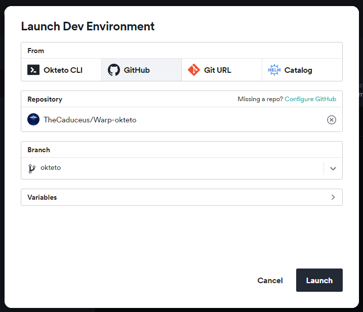

# ♻️ WARP UNLIMITED ADVANCED
**Get Unlimited amount of Data in Cloudflare's WARP/WARP+ VPN, most versatile Script translated in our beloved Python ! 😍**

## **📑 INDEX**
#### **Easily navigate through out the guide and pick the best method that suits you and your requirements!**
+ [**♻️ WARP UNLIMITED ADVANCED**](#warp-unlimited-new-methods)
+ [**🆕 What's New**](#whats-new)
+ [**📑 Features**](#features)
+ [**🪧 Before you Proceed**](#before-you-proceed)
+ [**⚙️ How to use ? 😅 How to get WARP/WARP+ ID ?**](#how-to-use)
+ [**→ 🕹️ Run on Google Colab**](#run-on-google-colab)
+ [**→ 🐳 Deploy using Docker**](#build-or-deploy-using-docker)
+ [**→ ⚡ Host on Heroku (24×7)**](#host-on-heroku)
+ [**→ 🧿 Host on Railway (24×7)**](#host-on-railway)
+ [**→ 🪬 Host on Okteto (24×7)**](#host-on-okteto)
+ [**→ 🖥️ Run on Computer**](#run-on-computer)
+ [**→ 🧫 Deploy through GitHub Actions**](#deploy-using-github-actions)
+ [**→ 📲 Run on Mobile Phone**](#run-on-mobile-phone)
+ [**→ 🎲 Run on Replit**](#run-on-replit)
+ [**→ 🧰 Run on Jupyter Server**](#run-on-jupyter-server)
+ [**→ 📈 Update Values (📲 For Mobile & 🖥️ For PC)**](#update-values)
+ [**🎯 Points to be Remembered**](#points-to-be-remembered)
+ [**📥 Download Cloudflare WARP (1.1.1.1)**](#download-cloudflare-warp-1111)
+ [**❓FAQ**](#faq)
+ [**🖥️ How to use this Data on PC ?**](#how-to-use-this-data-on-pc)
+ [**⛑ Contact Us !**](#contact-us)
+ [**❤️ Credits & Thanks**](#credits-thanks)
+ [**🍵 Other Projects**](#other-projects)

## **🆕 What's New**
**1. New Docker Image !**  
**2. Fixed Python code for VPS.**  
**3. Merged all branch in one.**  
**4. Now deployable to almost all platforms.**  
**5. Improvements in `.ipynb` file.**  
**Full Changelog: [`v3.0.5...v4.0.2`](https://github.com/TheCaduceus/WARP-UNLIMITED-ADVANCED/compare/v3.0.5...v4.0.2)**

## **📑 Features**
#### **1. Get 1GB Per 20 Seconds ! 🔥**
#### **2. Run this almost everywhere ! 🤗**

## **🪧 Before you Proceed**
**1. If you deploy this Code through Heroku, Railway app or Okteto then it will run for lifetime !**  
**2. It doesn't matter if you have WARP or WARP+, this trick works on both.**  
**3. Please consider that we are not hacking or gaining access to any Cloudflare system or their servers nor we are changing any official records illegally. We are just using Official Cloudflare's API.**

## **⚙️ How to use ?**
#### **0. First Get your WARP/WARP+ ID by going into `Settings > Advanced > Diagnostics` and copy the ID under `CLIENT CONFIGURATION` section *(note that you can get that ID only in the mobile app, not on the desktop app)***

## **🕹️ Run on Google Colab**
#### **1. Open this Code on Google Colab: [Open NoteBook](https://colab.research.google.com/github/TheCaduceus/WARP-UNLIMITED-ADVANCED/blob/main/WUA.ipynb)**  
#### **2. Now enter your `WARP_CLIENT_ID` and run The WARP+ (1.1.1.1) Code and as shown in the Image *(click on the Play button on top-left corner)***

#### **3. After that, let the code run. It will give you 1GB per 20 Seconds. But you have to update the value in the app! To do it**  
**Go to `Settings > Advanced > Connection options` and press on Reset security keys**

### **🐳 Build or Deploy using Docker**
**WARP UNLIMITED Script can be deployed almost everywhere using Docker because it can be kinda boring to add support or instruction/config file of each platform, so you can use Docker Image everywhere to deploy the script easily.**
#### **1. To pull Docker Image:**
**→ `docker pull ghcr.io/thecaduceus/wla:master`**
#### **2. Or, to use as base Image:**
**→ `FROM ghcr.io/thecaduceus/wla:master`**  
  
**⛔NOTE:**  
**1. You can make `config.env` to provide required variables.**  
**2. Variables must be same as discussed below for each platform.**

## **⚡Host on Heroku**
#### **1.First Click the below Deploy button.**

#### **2. Now, Enter the following values and click `Deploy` button:**
+ `App Name` Give a unique name to your app.
+ `WARP_ID` Enter your WARP/WARP+ ID.
+ `SEND_LOG` If you want to receive info about your deployed script like script working ?, amount of data generated or number of failed attempts. 0 for No and 1 for Yes.
+ `BOT_TOKEN` Enter BOT API TOKEN from Bot father which will send you the log in your channel or group. Bot must be admin in specific channel or group to send log. Required if SEND_LOG is 1.
+ `CHANNEL_ID` Enter Channel/Group ID (Channel/Group must be Public) with @ in which you want log to be send. Like @example or @mychannel.
+ `HIDE_ID` To hide WARP_ID in the log message send to Telegram Channel or Group. 0 for No and 1 for Yes.

#### **3. After Deployment, Click `Manage App` button and then click `Resources Tab` and enable the dyno.**

#### **4. Enjoy! Now you will get 1GB per 20 Seconds for Lifetime while your Heroku Account exist and you will start getting info about your script if `SEND_LOG` is enabled.**

## **🧿 Host on Railway**
#### **1. First, Create account or Login on [Railway](https://railway.app/)**

#### **2. Now click the following Railway deployment button:**

#### **3. After it, Enter the following values:**
+ `WARP_ID` Enter your WARP/WARP+ ID.
+ `SEND_LOG` If you want to receive info about your deployed script like script working ?, amount of data generated or number of failed attempts. 0 for No and 1 for Yes.
+ `BOT_TOKEN` Enter BOT API TOKEN from Bot father which will send you the log in your channel or group. Bot must be admin in specific channel or group to send log. Required if SEND_LOG is 1.
+ `CHANNEL_ID` Enter Channel/Group ID (Channel/Group must be Public) with @ in which you want log to be send. Like @example or @mychannel.
+ `HIDE_ID` To hide WARP_ID in the log message send to Telegram Channel or Group. 0 for No and 1 for Yes.
#### ***❗The Major Advantage of Railway is that it never restarts. So it will generate more amount of Data in 24 Hours compared to Heroku.***

## **🪬 Host on Okteto**
#### **Okteto is a Kubernetes development platform and is used by many users and it's ideal for lightweight apps, Okteto is worst than Heroku, your script will sleep after 24 hours and will not get back to online until you ping the provided ENDPOINT. So as a workaround, you can setup cron-job.**
#### **1. First Create your okteto Account. You need one GitHub account as okteto supports only one Method to either Create or Login: [Create Account](https://cloud.okteto.com/#/login)**

#### **2. Now import this Repository and deploy it on Okteto.**

#### **3. After that, carefully add the variables in Okteto deployment page:**
+ `WARP_ID` Enter your WARP/WARP+ ID.
+ `SEND_LOG` If you want to receive info about your deployed script like script working ?,amount of data generated or number of failed attempts. 0 for No and 1 for Yes.
+ `BOT_TOKEN` Enter BOT API TOKEN from Bot father which will send you the log in your channel or group. Bot must be admin in specific channel or group to send log. Required if SEND_LOG is 1.
+ `CHANNEL_ID` Enter Channel/Group ID (Channel/Group must be Public) with @ in which you want log to be send. Like @example or @mychannel.
+ `HIDE_ID` To hide WARP_ID in the log message send to Telegram Channel or Group. 0 for No and 1 for Yes.

#### **4. Then go to Okteto click on `Launch Dev Environment`, select your repository and change branch from main to okteto.**
#### **5. Finally, Click on Launch button to deploy your repository and Enjoy ! 😘**
#### **6. Additionally, you can setup cron-job using [Cron-Job.org](https://cron-job.org) to automatically restart your script one it sleeps after 24 hours.**

## **🖥️ Run on Computer**
#### **Running this script on your Computer is simple as ABC!**
#### **1. If your PC don't have python, then install it first: [Download Python](https://www.python.org/downloads/)**
#### **2. Now first open the WARP+ Unlimited Script code and paste it in notepad and save it as `Warp.py`, don't forget to type `.py`: [Show Code](https://github.com/TheCaduceus/WARP-UNLIMITED-ADVANCED/blob/main/WARP.md)**
#### **✍️ NOTE: The script code is available in two different versions → 1. Without Telegram logger and 2. With Telegram logger**
#### **3. Open a terminal and write `pip install nest-asyncio` then hit enter**
#### **4. After it run the code as shown in the Image, Enter WARP ID, Hit Enter and Enjoy !**

#### ***❗ The Script will run and give you 1GB data / 20 Second while your PC is on and the Window is open. Make sure that your PC or Local System is connected to INTERNET CONNECTION.***

## **🧫 Deploy using GitHub Actions**
#### **This Method is very easy and the best for users who want to deploy this script multiple times on Heroku without login on Heroku again and again !**
#### **1. First fork this Repository.**

#### **2. Now open the settings of your Forked Repository and click Secrets → Actions.**

#### **3. After doing that, create Following Secrets:**
+ `HEROKU_API_KEY` - Enter your Heroku API Key as value.
+ `HEROKU_APP_NAME` - A unique app name in small letters only.
+ `HEROKU_EMAIL` - Your Heroku Email ID.
+ `WARP_ID` - Enter your WARP/WARP+ ID. In capital only!
+ `SEND_LOG` - If you want to receive info about your deployed script like script working ?, amount of data generated or number of failed attempts. 0 for No and 1 for Yes.
+ `BOT_TOKEN:` Enter BOT API TOKEN from Bot father which will send you the log in your channel or group. Bot must be admin in specific channel or group to send log. Required if SEND_LOG is 1.
+ `CHANNEL_ID` Enter Channel/Group ID (Channel/Group must be Public) with @ in which you want log to be send. Like @example or @mychannel.
+ `HIDE_ID` To hide WARP_ID in the log message send to Telegram Channel or Group. 0 for No and 1 for Yes.

#### **5. Go to Actions Tab then click `Deploy on Heroku` and `Run Workflow`. Now it will be automatically got deployed on given Heroku Account ! 😉**

#### **5. It will take maximum 10 Seconds to start the Workflow and minimum 1-2 Minutes to get deployed !**

## **📲 Run on Mobile Phone**
#### **1. First Download the Termux app [from here](https://github.com/termux/termux-app/releases/latest) *(Play Store version is deprecated)*.**
#### **2. Now run the following commands in it one by one!**
1. `pkg install python` - This Command will Download Python.
2. `pkg install git` - This Command will Download Git.
3. `pip install nest-asyncio` - This Command will Download nest-asyncio.
4. `git clone https://github.com/TheCaduceus/WARP-UNLIMITED-ADVANCED` - This Command will clone this Repository in your Device.
5. `cd WARP-UNLIMITED-ADVANCED` - This Command will set Directory to this Repository's created Folder.
6. `python3 warp.py` - This Command will run the main Script.
7. Getting http/SSL Error ? Run following code to fix it:  
`termux-setup-storage && pkg update && pkg i git python wget -y && pkg upgrade && pip install --upgrade pip`

#### **3. After doing the above things, Enter your WARP ID and get started. 😚**

## **🎲 Run on Replit**
#### **1. Open the "WARP UNLIMITED" repl: [Open it](https://replit.com/@TheCaduceus/WARP-UNLIMITED)**
#### **2. Enter your WARP/WARP+ ID and press Enter to run the script. Enjoy ! 🙃**

## **🧰 Run on Jupyter Server**
#### **This method is best & effective alternative of "Run on Computer" method! Before using this method, let see how to Download & Setup Jupyter server which is pretty lightweight.**
##### **Setting up the Jupyter Server:**
#### **1. First install Python: [from here](https://www.python.org/downloads/)**
#### **2. Now run the CMD as Administrator and execute following commands one-by-one:**
1. `pip install jupyter` - To install Jupyter
2. `pip install notebook` - To install Notebook
3. `pip install voila` - To install Voila
4. `python -m notebook` - Start Jupyter Server
#### **3. Once you started your Server, Jupyter will give you its link (as shown in Image), just open it on your Browser.**

#### **4. Now Download the "Warp-on-Jupyter-Server.ipynb" file: [from here only](https://github.com/TheCaduceus/WARP-UNLIMITED-ADVANCED/blob/main/Warp_on_Jupyter_Server.ipynb)**
#### **5. After downloading it, Locate that file through your Jupyter server and open it as shown in the image and click Run.**

#### **6. Now enter your WARP/WARP+ ID and press Enter to continue.Enjoy ! 😉**

## **📈 Update Values**
#### **After Successfully Deploying or Running your Script, You have to update the "Data Remaining Value in your App."**
### **📲 For Mobile:**
#### **Go to `Settings → Advanced → Connection Options → Press Reset Security Keys`**
### **🖥️ For PC:**
#### **Just again Enter your Activation key! For getting Activation key, Open App in `Mobile → Settings → Account → Copy Key`**

## **🎯 Points to be Remembered**
#### **1. You have to manually update the Value in the app.**
#### **2. The Major Advantage of the Railway app is that, it never restarts. So it will generate more Amount of Data in 24 Hours if compared with Heroku**
#### **3. On your Computer, The Script will run and give you 1GB data / 20 Second while your PC is on and the Window is open.**
#### **4. This Tricks works on both WARP and WARP+.**
#### **5. If you are hosting this Script on your PC or Local System then confirm that it is connected to INTERNET CONNECTION.**

## **📥 Download Cloudflare WARP (1.1.1.1)**
**Cloudflare's WARP which is based on 1.1.1.1, world's fastest DNS resolver helps you to encrypt your Network traffic and surf the web faster and is available for major Operating-Systems (OS):**  
**📱Android: [Download Now !](https://play.google.com/store/apps/details?id=com.cloudflare.onedotonedotonedotone)**  
**📟iOS: [Download Now !](https://itunes.apple.com/us/app/1-1-1-1-faster-internet/id1423538627)**  
**🖥️Windows: [Download Now !](https://1111-releases.cloudflareclient.com/windows/Cloudflare_WARP_Release-x64.msi)**  
**🍎Mac: [Download Now !](https://1111-releases.cloudflareclient.com/mac/Cloudflare_WARP.zip)**  
**💻Linux: [Download Now !](https://pkg.cloudflareclient.com/)**

## **❓FAQ**
#### **1. How much scripts can I host/run for same account ?**
**I will recommend to host/run 3 or less than 3 (< 3) scripts for each account because Cloudflare's API have request limits. Hosting/Running too many scripts can cause "Too many Requests" error which indicates that API is getting too many requestes from the same account and that is why there is a cooldown timer of 20 seconds to prevent this.**
#### **2. How to resolve "Too many request" Error ?**
**As already discussed above, Hosting/Running too many scripts for same account cause this. So just switch off the scripts and bring down the number to 3 or < 3 scripts for the same account. Please refer to [Issue #3](https://github.com/TheCaduceus/WARP-UNLIMITED-ADVANCED/issues/3) for more details on this.**
#### **3. Will this script cause any kind of ban from Cloudflare?**
**No, this script don't cause ban because it just use the API provided by Cloudflare for referral system. Neither this script create any type of load or bypass any limit set by Cloudflare for there API nor it hacks anything or changes any official record illegally.**
#### **4. Script isn't working & producing error as shown in the image in Termux. How to solve ?**
  
**This problem happens due to missing files! you can run the below given command in Termux to fix it easily:**  
`termux-setup-storage && pkg update && pkg i git python wget -y && pkg upgrade && pip install --upgrade pip`
#### **5. Does deploying this on Heroku/Railway/Okteto/Vercel cause any ban?**
**No, this script comes in category of Cron-Job because this script just take the WARP/WARP+ ID from user and arrange it in a particular format and start pinging it in an interval of 20 seconds. This script is lightweight and don't have any load on system. You can refer to [Issue #5](https://github.com/TheCaduceus/WARP-UNLIMITED-ADVANCED/issues/5) for more details on this.**

## **🖥️ How to use this Data on PC?**
#### **Open the WARP or 1.1.1.1 app in your Phone and go to `Settings > Account > Key` and copy the License Key. Now paste that Key in your Warp app in Windows or MacOS or Linux.**

## **⛑ Contact Us !**
#### **Join our Update Channel at Telegram: [@TheCaduceusOfficial](https://t.me/TheCaduceusOfficial)**
#### **Directly Contact the Developer using Telegram [@HelpAutomatted_Bot](https://telegram.me/HelpAutomatted_Bot)**

## **❤️Credits & Thanks**
**[Dr.Caduceus](https://github.com/TheCaduceus): For heavy modification as well as making New 10 Methods and this all in one Guide.**  
**[ALI-B](https://github.com/ALIILAPRO): The Original Developer of the Base Script**

## 🍵Other Projects
- **[Dr.Graph](https://drgraph.cf/): Online Anonymous Text / Pasting platform without limits.**
- **[Dr.FileStreamBot](https://drfilestreambot.t.me/): Get Download / Stream links for Telegram files and use as host.**
