<div align="center">
<a name="warp-unlimited-new-methods"></a>

# ♻️ WARP UNLIMITED ADVANCED
**Get Unlimited amount of Data in Cloudflare's WARP/WARP+ VPN, most versatile code translated in our beloved Python ! 😍**
</div>

## **📑 INDEX**
#### **Easily navigate through out the guide and pick the best method that suits you and your requirements!**
+ [**♻️ WARP UNLIMITED ADVANCED**](#warp-unlimited-new-methods)
+ [**🆕 What's New**](#whats-new)
+ [**📑 Features**](#features)
+ [**🪧 Before you Proceed**](#before-you-proceed)
+ [**⚙️ How to use ? 😅 How to get WARP/WARP+ ID ?**](#how-to-use)
+ [**→ 🕹️ Run on Google Colab**](#run-on-google-colab)
+ [**→ ⚡ Host on Heroku (24×7)**](#host-on-heroku)
+ [**→ 🧿 Host on Railway (24×7)**](#host-on-railway)
+ [**→ 🪬 Host on Okteto (24×7)**](#host-on-okteto)
+ [**→ 🖥️ Run on Computer/VPS**](#run-on-computer)
+ [**→ 🧫 Deploy through GitHub Actions**](#deploy-using-github-actions)
+ [**→ 📲 Run on Mobile Phone**](#run-on-mobile-phone)
+ [**→ 🎲 Run on Replit**](#run-on-replit)
+ [**→ 🧰 Run on Jupyter Server**](#run-on-jupyter-server)
+ [**→ 📈 Update Values (📲 For Mobile & 🖥️ For PC)**](#update-values)
+ [**🎯 Points to be Remembered**](#points-to-be-remembered)
+ [**📥 Download Cloudflare WARP (1.1.1.1)**](#download-cloudflare-warp-1111)
+ [**❓FAQ**](#faq)
+ [**🖥️ How to use this Data on PC ?**](#how-to-use-this-data-on-pc)
+ [**⛑ Contact Us**](#contact-us)
+ [**❤️ Credits & Thanks**](#credits-thanks)
+ [**🍵 Other Projects**](#other-projects)

<a name="whats-new"></a>

## **🆕 What's New**
**1. New Interactive mode!** <br>
**2. Get values from System Environment.** <br>
**3. Log Events inside `runtime-log.txt`** <br>
**4. Fixed error when `SEND_LOG` is not enabled & `BOT_TOKEN` not provided.** <br>
**5. New repl for [replit.com](https://replit.com).** <br>
**6. Added building instructions in `Dockerfile` for Docker Image.** <br>
**7. Fixed the broken code due to which program was not working.** <br>
**8. Bot will now not flood chat with multiple messages, will edit same message continuously.** <br>
**9. Changed `CHANNEL_ID` to `CHAT_ID`.**
**10. Replaced `config.env` with `config.py`**
**11. Fixed Okteto deployment.**

<a name="features"></a>

## **📑 Features**
#### **1. Get 1GB Per 20 Seconds ! 🔥**
#### **2. Run this almost everywhere ! 🤗**
#### **3. Get Notification on Telegram. 🔔**

<a name="before-you-proceed"></a>

## **🪧 Before you Proceed**
**1. If you deploy this Code through Heroku, Railway app or Okteto then it will run for lifetime !**  
**2. It doesn't matter if you have WARP or WARP+, this program works for both.**  
**3. We are not hacking or gaining access to any Cloudflare system or their servers nor we are changing any official records illegally. We are just using Official Cloudflare's API.**

<a name="how-to-use"></a>

## **⚙️ How to use ?**
#### **0. First Get your WARP/WARP+ ID by going into `Settings > Advanced > Diagnostics` and copy the ID under `CLIENT CONFIGURATION` section *(note that you can get that ID only in the mobile app, not on the desktop app)***
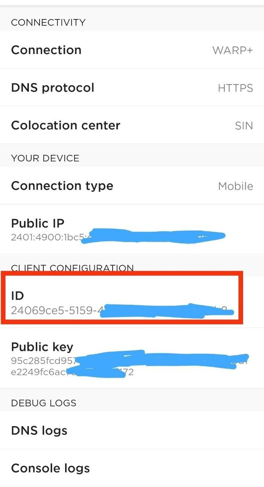

<a name="variables"></a>
## **✏️ Variables**
**Below given variables should be filled in config.py file or can be set as Environment Variables, while you can also enable `INTERACTIVE_MODE` to enter new values during each run.**
- **`ENV`: Set it to `True` if you let program get values from system environment or `False` if you are filling it in `config.py` itself or incase of `INTERACTIVE_MODE` `bool`**
- **`INTERACTIVE_MODE`: Set it to `True` if you want program to ask for new values during each run or simply `False`. `bool`**
- **`WARP_ID`: Enter your WARP CLIENT ID. [How to get?](#how-to-use) `str`**
- **`SEND_LOG`: Get notification on Telegram regarding total data generated, total attempts & failed attempts. `0` = No & `1` = Yes. `str`**
- **`BOT_TOKEN`: Enter Telegram BOT API Token from [@BotFather](https://botfather.t.me/). Required if `SEND_LOG` is `True`. `str`**
- **`CHAT_ID`: Enter CHAT_ID on which you want log message to be sent. It can be Chat ID (mostly for private chats) like `-1001877005515` or Chat Username like `@mychannel` or `@mygroup`. `str`**
- **`HIDE_ID`: To hide your WARP CLIENT ID from log message sent to your chat. `0` = No & `1` = Yes. `str`**

<a name="run-on-google-colab"></a>

## **🕹️ Run on Google Colab**
#### **1. Open Code on Google Colab: [Open NoteBook](https://colab.research.google.com/github/TheCaduceus/WARP-UNLIMITED-ADVANCED/blob/main/ipynb/Colab.ipynb)**  
#### **2. Now enter your `WARP_CLIENT_ID` and run The WARP (1.1.1.1) Code as shown in the Image *(click on the Play button on top-left corner)***
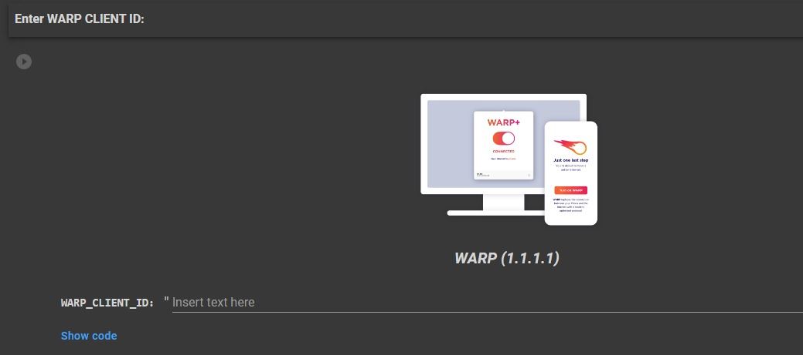
  
<a name="host-on-heroku"></a>

## **⚡Host on Heroku**
#### **1.First Click the below Deploy button.**
[](https://heroku.com/deploy?template=https://github.com/TheCaduceus/WARP-UNLIMITED-ADVANCED/tree/sys-env)
#### **2. Now, Enter the values as discussed above and click `Deploy` button.**
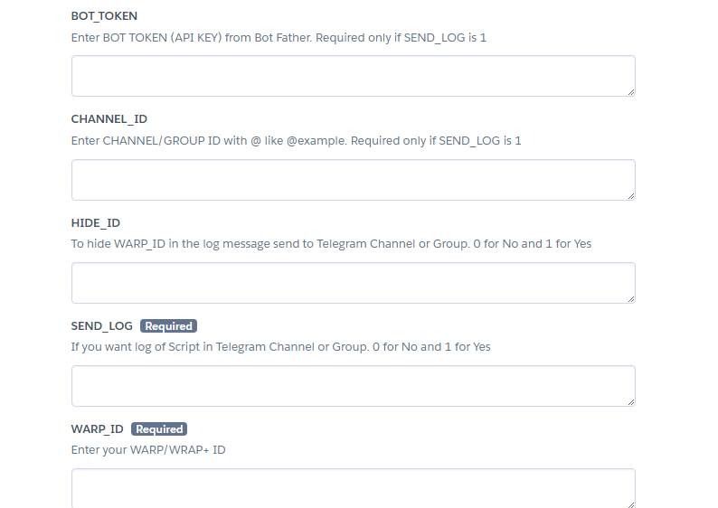

#### **3. After Deployment, Click `Manage App` button and then click `Resources Tab` and enable the dyno.**
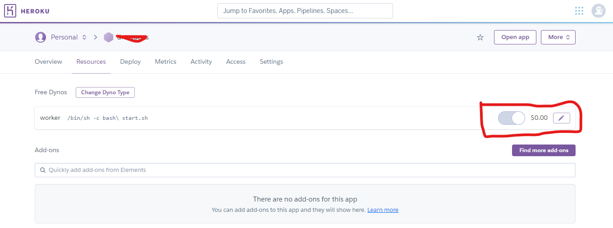

#### **4. Enjoy! Now you will get 1GB per 20 Seconds for Lifetime while your Heroku Account exist.**

<a name="host-on-railway"></a>

## **🧿 Host on Railway**
#### **1. First, Create account or Login on [Railway](https://railway.app/)**
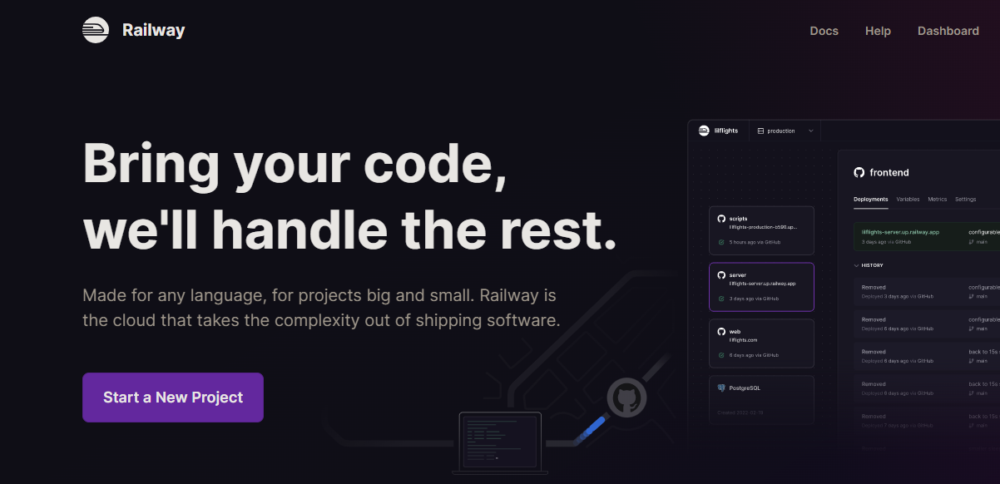

#### **2. Now click the following Railway deployment button:**
[](https://railway.app/new/template/e0er7k?referralCode=PFHpF8)

#### **3. Now, enter the values as discussed above and click `Deploy` button.**

<a name="host-on-okteto"></a>

## **🪬 Host on Okteto**
#### **1. First Create your okteto Account. You need one GitHub account as okteto supports only one Method to either Create or Login: [Create Account](https://cloud.okteto.com/#/login)**
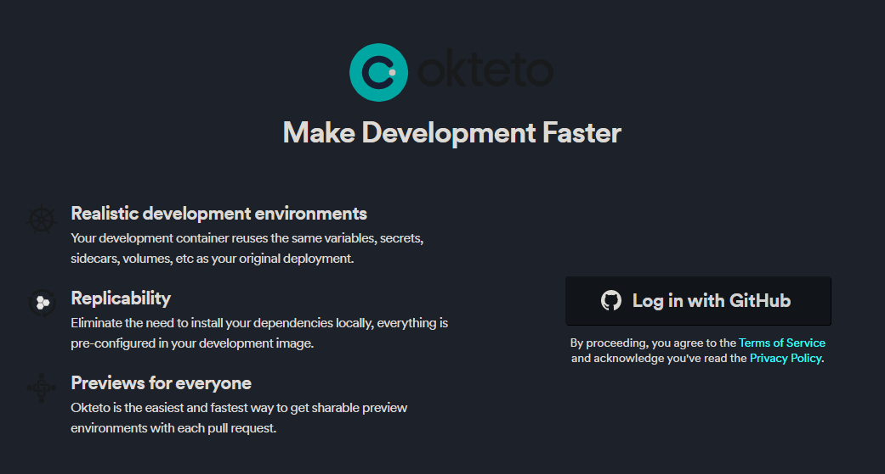

#### **2. Now import this Repository and deploy it on Okteto.**
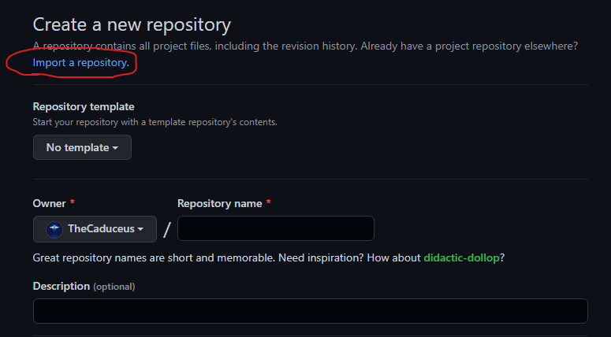
#### **3. After that, carefully add the values as discussed above in Okteto deployment page.**
#### **4. Finally, Click on Launch button to deploy your repository.**
#### **5. Additionally, you can setup cron-job using [Cron-Job.org](https://cron-job.org) to automatically restart your program once it sleeps after 24 hours.**

<a name="run-on-computer"></a>

## **🖥️ Run on Computer/VPS**
#### **1. If your PC don't have python & git, then install them first: [Python](https://www.python.org/downloads/), [Git](https://git-scm.com/downloads)**
#### **2. Download Repository:**
```
git clone https://github.com/TheCaduceus/WARP-UNLIMITED-ADVANCED.git
```
#### **3. Install requirements:**
```
pip install -r requirements.txt
```
#### **4. Fill `config.py` as [discussed here](#variables).**
#### **5. Run the program:**
```
py warp-plus.py
```
#### **6. Logs can be accessed in `runtime-log.txt` file:**
```
cat runtime-log.txt
```

<a name="deploy-using-github-actions"></a>

## **🧫 Deploy using GitHub Actions**
#### **1. First fork this Repository.**
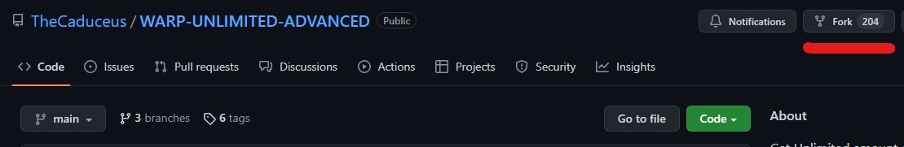
#### **2. Now open the settings of your Forked Repository and click Secrets → Actions.**

#### **3. After doing that, create following values as secret + values [discussed here](#variables):**
+ `HEROKU_API_KEY` - Enter your Heroku API Key as value.
+ `HEROKU_APP_NAME` - A unique app name in small letters only.
+ `HEROKU_EMAIL` - Your Heroku Email ID.

#### **5. Go to Actions Tab then click `Deploy on Heroku` and `Run Workflow`. Now it will be automatically got deployed on given Heroku Account ! 😉**
#### **5. It will take maximum 10 Seconds to start the Workflow and minimum 1-2 Minutes to get deployed !**

<a name="run-on-mobile-phone"></a>

## **📲 Run on Mobile Phone**
#### **1. First Download the Termux app [from here](https://github.com/termux/termux-app/releases/latest) *(Play Store version is deprecated)*.**
#### **2. Now run the following commands in it one by one!**
1. Download Python:
```
pkg install python
```
2. Download Git:
```
pkg install git
```
3. Install requirements:
```
pip install -r requirements.txt
```
4. Download Repository:
```
git clone https://github.com/TheCaduceus/WARP-UNLIMITED-ADVANCED.git
```
6. Run the program:
```
python warp.py
```
7. Getting http/SSL Error ? Run following code to fix it:  
```
termux-setup-storage && pkg update && pkg i git python wget -y && pkg upgrade && pip install --upgrade pip
```
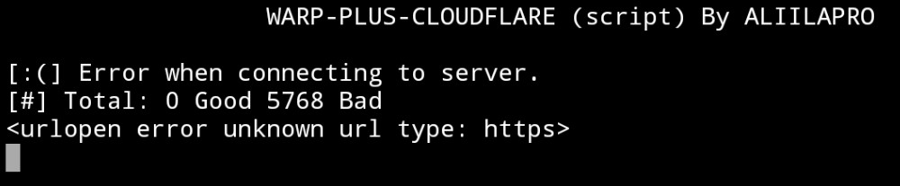
#### **3. After doing the above steps, Enter your WARP ID and get started. 😚**

<a name="run-on-replit"></a>

## **🎲 Run on Replit**
#### **1. Open our repl: [Open it](https://replit.com/@TheCaduceus/WARP-UNLIMITED)**
#### **2. Enter your WARP CLIENT ID and press enter to run the program.**
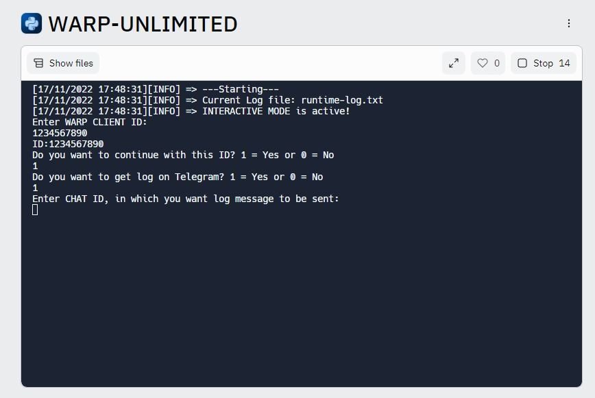
### **3. Additionally, you can fork the repl & edit `config.py` to enable / disable required features.**

<a name="run-on-jupyter-server"></a>

## **🧰 Run on Jupyter Server**
##### **Setting up the Jupyter Server:**
#### **1. First install Python with PIP: [from here](https://www.python.org/downloads/)**
#### **2. Now run the CMD as Administrator and execute following commands one-by-one:**
1. To install Jupyter:
```
pip install jupyter
```
2. To install Notebook:
```
pip install notebook
```
3. To install Voila:
```
pip install voila
```
4. Start Jupyter Server:
```
python -m notebook`
```
#### **3. Once you started your Server, Jupyter will give you its link (as shown in Image), just open it in your Browser.**
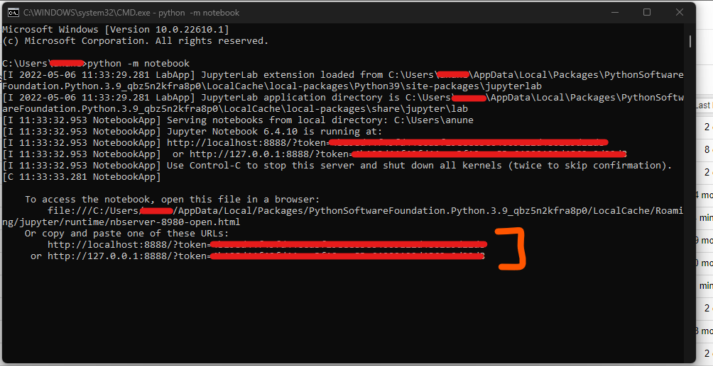
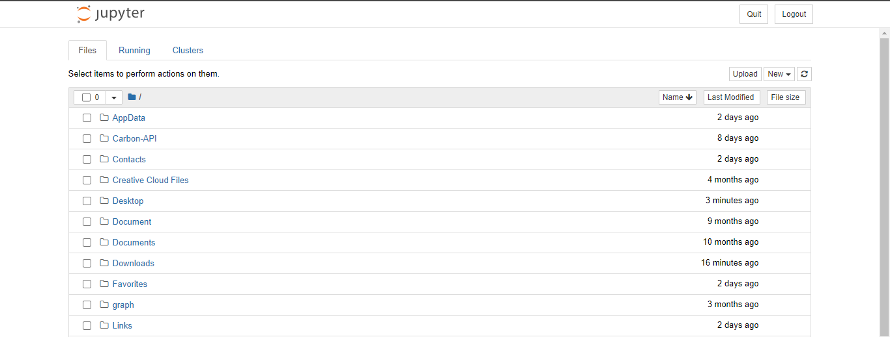
#### **4. Now Download the "Server.ipynb" file: [from here only](https://github.com/TheCaduceus/WARP-UNLIMITED-ADVANCED/blob/main/ipynb/Server.ipynb)**
#### **5. After downloading it, Locate that file through your Jupyter server and open it as shown in the image and click Run.**
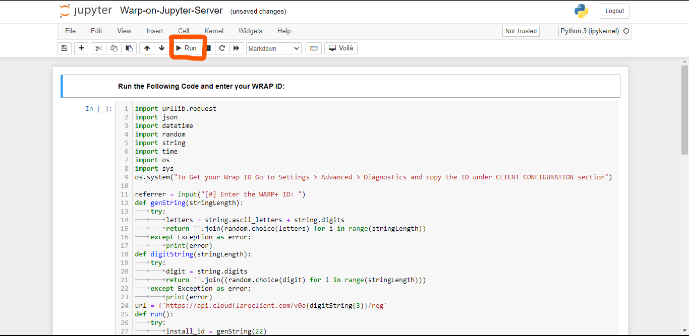
#### **6. Now enter your WARP CLIENT ID and press Enter to continue.**

<a name="update-values"></a>

## **📈 Update Values**
#### **After deploying or running this program, you have to update the "Data Remaining" value in your App.**
### **📲 For Mobile:**
#### **Go to `Settings → Advanced → Connection Options → Press Reset Security Keys`**
### **🖥️ For PC:**
#### **Just again Enter your Activation key! For getting Activation key, Open App in `Mobile → Settings → Account → Copy Key`**

<a name="points-to-be-remembered"></a>

## **🎯 Points to be Remembered**
#### **1. You have to manually update the value in the app.**
#### **2. On your device, the program will run and give you 1GB data / 20 Second while your machine is on and the terminal window is open.**
#### **3. If you are hosting this program on your PC or Local System then confirm that it is connected to INTERNET CONNECTION.**

<a name="download-cloudflare-warp-1111"></a>

## **📥 Download Cloudflare WARP (1.1.1.1)**
**Cloudflare's WARP which is based on 1.1.1.1, world's fastest DNS resolver helps you to encrypt your Network traffic and surf the web faster and is available for major Operating-Systems (OS):**  
**📱Android: [Download Now !](https://play.google.com/store/apps/details?id=com.cloudflare.onedotonedotonedotone)**  
**📟iOS: [Download Now !](https://itunes.apple.com/us/app/1-1-1-1-faster-internet/id1423538627)**  
**🖥️Windows: [Download Now !](https://1111-releases.cloudflareclient.com/windows/Cloudflare_WARP_Release-x64.msi)**  
**🍎Mac: [Download Now !](https://1111-releases.cloudflareclient.com/mac/Cloudflare_WARP.zip)**  
**💻Linux: [Download Now !](https://pkg.cloudflareclient.com/)**

<a name="faq"></a>

## **❓FAQ**
#### **1. How many instances of the program I can run simultaneously for same account ?**
**I will recommend to host/run 3 or less than 3 (< 3) instances for each account because Cloudflare's API have request limits. Hosting/Running too many instances can cause "Too many Requests" error which indicates that API is getting too many requestes from the same account and that's why there is a cooldown timer of 20 seconds to prevent this.**
#### **2. How to resolve "Too many request" Error ?**
**As already discussed above, Hosting/Running too many instances for same account cause this. So just switch off some instances and bring down the number to 3 or < 3 instances for the same account. Please refer to [Issue #3](https://github.com/TheCaduceus/WARP-UNLIMITED-ADVANCED/issues/3) for more details on this.**
#### **3. Will this program cause any kind of ban from Cloudflare?**
**No, this program don't cause ban because it just use the API provided by Cloudflare for referral system. Neither this program create any type of load or bypass any limit set by Cloudflare for there API nor it hacks anything or changes any official record illegally.**
#### **4. Program isn't working & producing error as shown in the image in Termux. How to solve ?**
  
**This problem happens due to missing files! you can run the below given command in Termux to fix it easily:**  
`termux-setup-storage && pkg update && pkg i git python wget -y && pkg upgrade && pip install --upgrade pip`
#### **5. Does deploying this on Heroku/Railway/Okteto cause any ban?**
**No, this program comes in category of Cron-Job because this program just take the WARP CLIENT ID from user and arrange it in a particular format and start pinging it in an interval of 20 seconds. This program is lightweight and don't have any load on system. You can refer to [Issue #5](https://github.com/TheCaduceus/WARP-UNLIMITED-ADVANCED/issues/5) for more details on this.**
### **6. I deployed it on a platform that allow setting Environment Variables, but program not accepting it?**
**Before deploying it on any platform which allow users to set variables in system environment, just make sure you enable `ENV` mode & disable `INTERACTIVE_MODE`.**

<a name="how-to-use-this-data-on-pc"></a>

## **🖥️ How to use this Data on PC?**
#### **Open the WARP or 1.1.1.1 app in your Phone and go to `Settings > Account > Key` and copy the License Key. Now paste that Key in your Warp app in Windows or MacOS or Linux.**

<a name="contact-us"></a>

## **⛑ Contact Us !**
#### **Join our Update Channel at Telegram: [@TheCaduceusOfficial](https://t.me/TheCaduceusOfficial)**
#### **Directly Contact the Developer using Telegram [@HelpAutomatted_Bot](https://telegram.me/HelpAutomatted_Bot)**

<a name="credits-thanks"></a>

## **❤️Credits & Thanks**
**[Dr.Caduceus](https://github.com/TheCaduceus): For heavy modification as well as making New 10 Methods and this all in one Guide.**  
**[ALI-B](https://github.com/ALIILAPRO): The Original Developer of the Base Script**

<a name="other-projects"></a>

## 🍵Other Projects
- **[Dr.Graph](https://drgraph.cf/): Online Anonymous Text / Pasting platform without limits.**
- **[Dr.FileStreamBot](https://drfilestreambot.t.me/): Get Download / Stream links for Telegram files and use as host.**
