# WARP+ UNLIMITED (New Methods!😊)
<b>Get Unlimited amount of Data in Cloudflare's WARP/WARP+ VPN</b>
<h2><b>🆕What's New</b></h2>

<b>1.Railway Deployment Guide updated and improved!😗</b>

<b>2. Deployment through Okteto Added!😎</b>

<b>3. Deployment through GitHub Actions Added!⚡</b>

<h2><b>📑 Features</b></h2>
<h4><b>1.Get 1GB Per 10 Seconds!🔥</b></h4>
<h2><b>🪧Before you Procced</b></h2>

<b>1.Using this code on Google Colab will only work for 24 Hours if Time out preventer is used and that Tab is opened in your Phone or PC.</b>

<b>2.If you deploy this Code through Heroku or Railway app then it will run for lifetime!</b>

<b>3.It does not matter this trick works on both that's on WARP or WARP+.</b>

<h2><b>⚙️ How to use ?</b></h2>
<h4><b>1.First Get your Warp+ ID by going into Settings > Advanced > Diagnostics and copy the ID under CLIENT CONFIGURATION section</b></h4>

<h2><b>🕹️ Through Google Colab</b></h2>
<h4><b>2.First Open this Code on Google Colab:
<h4><b>3.Now Run the Timeout Preventer to prevent Google Colab from getting timeout</b></h4>

<h4><b>4.Then Run The WARP+ (1.1.1.1) Code and Enter your Warp ID (Also Hit Enter after it!) as shown in the Image</b></h4>

<h4><b>5.After that! Let the code run, It will give you 1GB per 10 Seconds. But you have to update the value in the app! To do it Go to Settings > Advanced > Connection options and press on Reset security keys</b></h4>
<h4><b><i>❗You have to manually update the Value in the app as written in above step❗</i></b></h4>
<h2><b>⚡Through Heroku</b></h2>
<h4><b>1.First open the app deployment page:<a href="https://heroku.com/deploy?template=https://github.com/TheCaduceus/WARP-UNLIMITED-ADVANCED/tree/Heroku"> Open it!</a></b></h4>
<h4><b>2.Now Enter a unique App name and your Warp+ ID and click Deploy as shown in the Image.</b></h4>
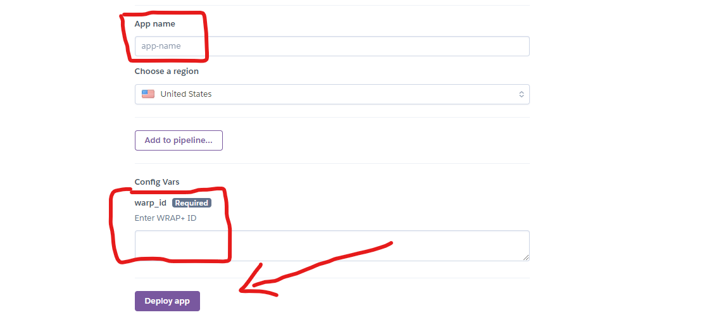
<h4><b>3.After Deployment! Click "Manage App" button and then click "Resources" Tab and enable the dyno.</b></h4>

<h4><b>4.Enjoy! Now you will get 1GB per 10 Seconds for Lifetime until your Heroku Account exist.</b></h4>
<h4><b><i>❗You have to manually update the Value in the app To do it Go to Settings > Advanced > Connection options and press on Reset security keys</b></h4>❗</i></b></h4>
<h2><b>🧿 Through Railyway App</b></h2>
<h4><b>1.First Create Account or Login on <a href="https://railway.app/">Railway App</a></b></h4>

<h4><b>2.Now Fork my Different Repository! <a href="https://github.com/TheCaduceus/Backend-Support-Railway-W-UV">From Here</a></b></h4>
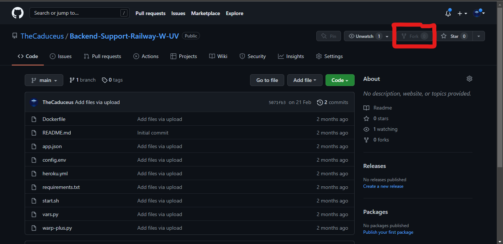
<h4><b>3.Go to <a href="https://railway.app/dashboard">Railway App Dashboard</a> and Click "New Project".</b></h4>
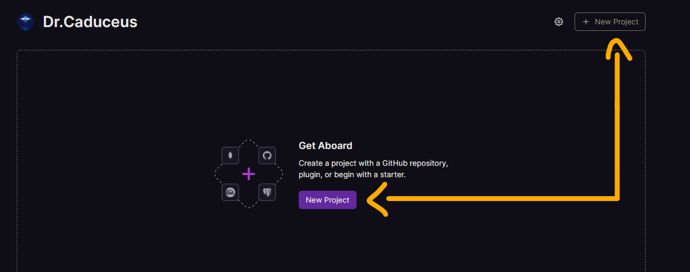
<h4><b>4.After it Choose "Deploy from Repo"</b></h4>
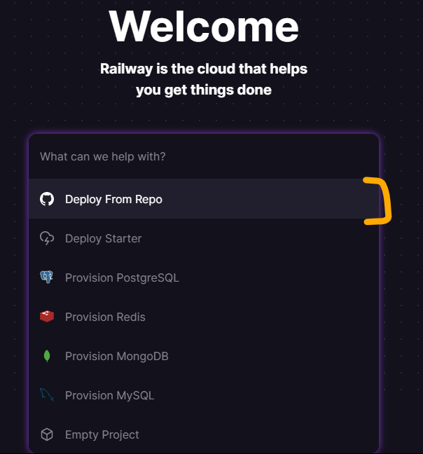
<h4><b>5.Choose the Forked Repository and select "Add Variables" and add "warp_id" as Variable name and your "WARP ID" as its value.</b></h4>

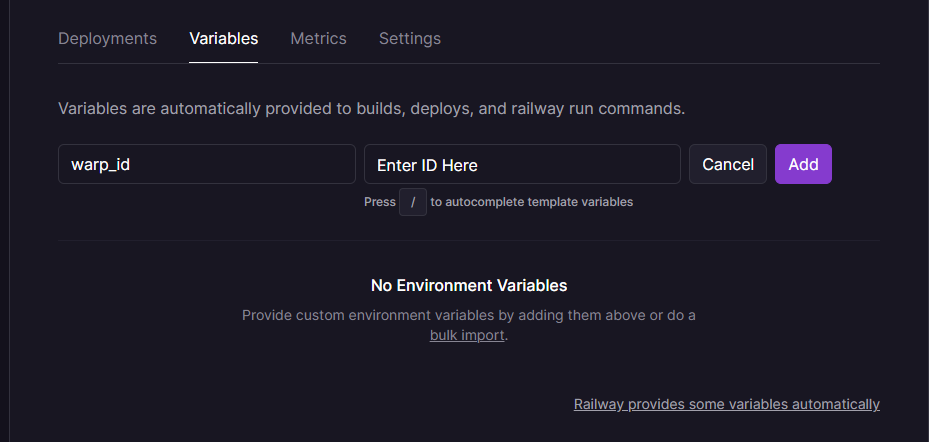
<h4><b>5.Finally Everything is done! Now Railway will do everything itself.😌</b></h4>
<h4><b><i>❗The Major Advantage of the Railway app is that, it never restarts. So it will generate more Amount of Data in 24 Hours if compared with Heroku.❗</i></b></h4>
<h2><b>🪬 Through Okteto</b></h2>
<h4><b>Okteto is also a best Platform like Railway, people like it because it does not restart your deployed app after 24 Hours unlike Heroku do. There are only some points we need to keep in our mind to use it effectively your will see it in this Section!</b></h4>
<h4><b>1.First Create your okteto Account, You need one GitHub account as okteto supports only one Method to either Create or Login: <a href="https://cloud.okteto.com/#/login">Create Account</a></b></h4>

<h4><b>2.Now fork this Repository and go to Okteto and click "Launch Dev Environment" button as shown in the image.</b></h4>
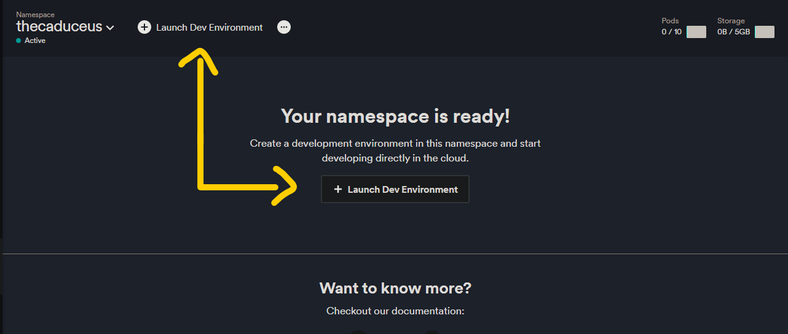
<h4><b>3.After that, Select GitHub from the pop-up and select your forked repository named "WARP-UNLIMITED-ADVANCED" and choose Branch "Okteto" and add "warp_id" as variable name and enter your Warp ID as its value.See the Image carefully!</b></h4>

<h4><b>4.Finally! You are ready to click "Launch" button and then okteto will do everything automatically. Enjoy!🎉</b></h4>
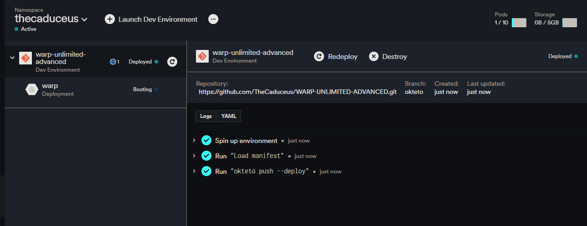
<h4><b>❗Okteto turns sleeping mode on your Deployed app, if its provided Domain don't got pinged within 24 Hours! So to prevent this follow the below steps❗</b></h4><b>5.To prevent your app from going into sleep! Copy its URL provided by the Okteto, to get it click on warp as shown in the image.</b></h4>
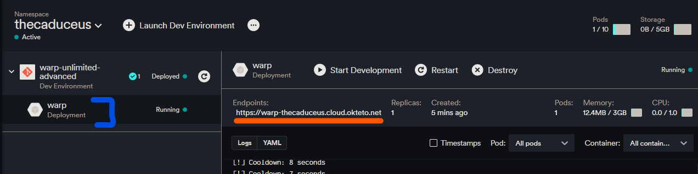
<h4><b>6.Now go to <a href="https://cron-job.org/en/">Cron Job</a> and click Sign Up and make your Account</b></h4>
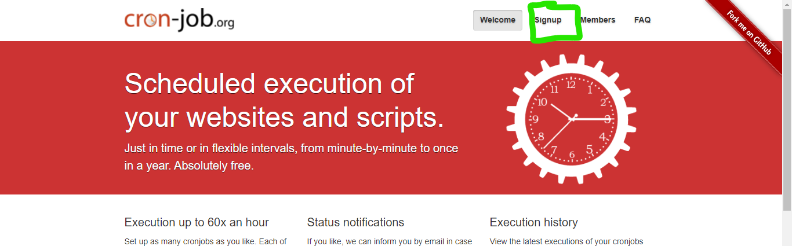
<h4><b>7.After creating your account! Click "CREATE CRONJOB".</b></h4>
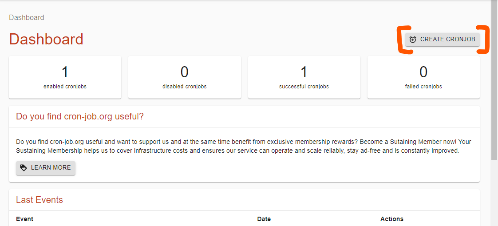
<h4><b>8.It will now ask you for Title and URL. Give any title and paste the copied URL and set Execution to after 60 Minutes and press "CREATE" button.</b></h4>
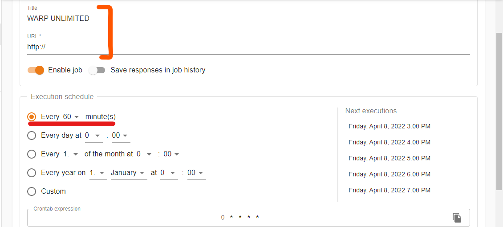
<h4><b>9.Your Script is now all good and will not cause any problem if you follow above written steps carefully!😎</b></h4>
<h2><b>🖥️ Host on Computer</b></h2>
<h4><b>Running this script on your Computer is simple than ABC!</b></h4>
<h4><b>1.If your PC do not have python! Then install it first: <a href="https://www.python.org/downloads/">Download Python</a></b></h4>
<h4><b>2.Now first open the WRAP+ Unlimited Script code and paste it in notepad and save it as "warp.py" don't forget to type ".py":<a href="https://github.com/TheCaduceus/WARP-UNLIMITED-ADVANCED/blob/View-Script/Warp.md"> Show Code</a></b></h4>
<h4><b>3.After it run the code as shown in the Image and Enter WARP ID and Hit Enter and Enjoy!</b></h4>

<h4><b><i>❗The Script will run and give you 1GB data / 10 Second until your PC is on and the Window is open. Make sure that your PC or Local System is connected to INTERNET CONNECTION.❗</i></b></h4>
<h2><b>🧫 Through GitHub Actions</b></h2>
<h4><b>This Method is too much easier and best for users who want to deploy this script multiple times on Heroku without login on Heroku again and again!</b></h4>
<h4><b>1.First fork my different Repository <a href="https://github.com/TheCaduceus/GA-1OFM-">here</a></b></h4>

<h4><b>2.Now open the settings of your Forked Repository and click Secrets->Actions.</b></h4>

<h4><b>3.After doing that, create Following Secrets:</b></h4>

<b>
  1.HEROKU_API_KEY - Enter your Heroku API Key as value. 
  2.HEROKU_APP_NAME - A unique app name in small letters only. 
  3.HEROKU_EMAIL - Your Heroku Email ID. 
  4.warp_id - Enter your warp ID. Keep the Variable name in small letters only "warp_id" otherwise heroku will confuse. 
  </b>

  
<h4><b>4.Go to Actions Tab then click "Deploy on Heroku" and "Run Workflow". Now it will be automatically got deployed on given Heroku Account!😉</b></h4>

<h4><b>5.It will take maximum 10 Seconds to start the Workflow and minimum 1-2 Minutes to get deployed!</b></h4>
<h2><b>📲 Host on Mobile Phone</b></h2>
<h4><b>1.First Download the Termux app from Google Play Store.</b></h4>
<h4><b>2.Now run the following commands in it one by one!</b></h4>

<b>
  1.pkg install python - This Command will Download Python. 
  2.pkg install git - This Command will Download Git. 
  3.git clone https://github.com/TheCaduceus/WARP-UNLIMITED-ADVANCED - This Command will clone this Repository in your Device. 
  4.cd WARP-UNLIMITED-ADVANCED - This Command will set Directory to this Repository's created Folder. 
  5.python3 warp.py - This Command will run the main Script.
  </b>

  <h4><b>3.After above! Now Enter your WARP ID and get started.😚</b></h4>
<h2><b>📈Update Values</b></h2>
<h4><b>After Successfully Deploying or Running your Script! You have to update the "Data Remaining Value in your App."</b></h4>
<h3><b>📲For Mobile:</b></h3>
<h4><b>Go to Settings-->Advanced-->Connection Options-->Press Reset Security Keys</b></h4>
<h3><b>🖥️For PC:<b></h3>
<h4><b>Just again Enter your Activation key! For getting Activation key, Open App in Mobile-->Settings-->Account-->Copy Key</b></h4>
<h2>🎯Points to be Remembered</h2>
<h4><b>1.You have to manually update the Value in the app.</b></h4>
<h4><b>2.The Major Advantage of the Railway app is that, it never restarts. So it will generate more Amount of Data in 24 Hours if compared with Heroku</b></h4>
<h4><b>3.On your Computer,The Script will run and give you 1GB data / 10 Second until your PC is on and the Window is open.</b></h4>
<h4><b>4.This Tricks works on both! That's WARP or WARP+.</b></h4>
<h4><b>5.If you are hosting this Script on your PC or Local System then confirm that it is connected to INTERNET CONNECTION.</b></h4>
<h4><b>6.Okteto turns sleeping mode on your Deployed app, if its provided Domain don't got pinged within 24 Hours! Please Refer to STEPS 5-9 under Okteto section to know how to prevent it.</b></h4>
<h2><b>🎮How to use this Data on PC!</b></h2>
<h4><b>Open the WARP or 1.1.1.1 app in your Phone and go to Settings > Account > Key and copy the License Key | Now paste that Key in your Warp app in Windows or MacOS</b></h4>
<h2><b>⛑Contact Us!</b></h2>
<h4><b>Join our Update Channel at Telegram:<a href="https://telegram.me/TheCaduceusUPDATE"> Join Now!</a></b></h4>
<h4><b>Directly Contact the Developer using Telegram <a href="https://telegram.me/HelpAutomatted_Bot">@HelpAutomatted_Bot</a></b></h4>
<h2><b>❤️Credits & Thanks</b></h2>

<b><a href="https://github.com/TheCaduceus">Dr.Caduceus</a>: For heavy modification as well as making New 7 Methods and this all in one Guide.</b>

<b><a href="https://github.com/ALIILAPRO">ALI-B</a>: The Original Developer of the Base Script</b>

